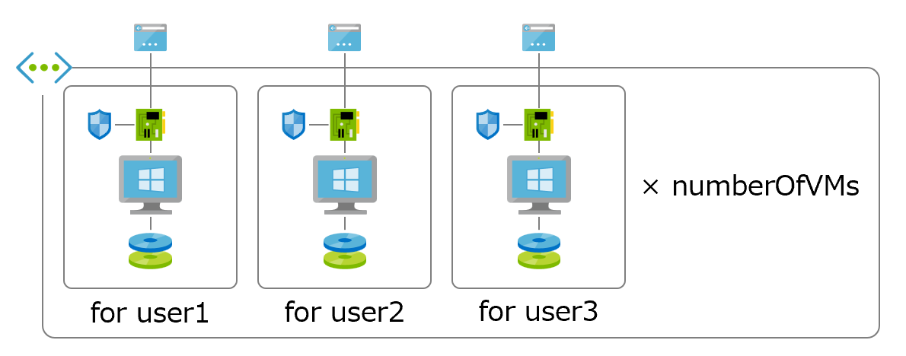

# New-AzWin10LabEnv
The script to create multiple Windows 10 pro VMs in Azure

# Usage

If you want to create 10 Vms in "eval" resouce group, run the following command.

`./New-AzWin10LabEnv.ps1 -numberOfVMs 10 -resourceGroupName eval`



# Sample

```powershell
PS  ./New-AzWin10LabEnv.ps1 -numberOfVMs 10 -resourceGroupName hogehoge11

DeploymentName          : New-AzWin10LabEnv
ResourceGroupName       : hogehoge11
ProvisioningState       : Succeeded

Outputs                 :
                          Name             Type                       Value
                          ===============  =========================  ==========
                          msg              Array                      [
                            {
                              "vmName": "vmuser0",
                              "dnsLabelPrefix": "vmuser0-hvbxqj4xbs3e4.eastus.cloudapp.azure.com",
                              "adminUsername": "evaluser0",
                              "adminPassword": "@s/;J^`*a_6N@user0Lab"
                            },
                            {
                              "vmName": "vmuser1",
                              "dnsLabelPrefix": "vmuser1-c2jh7s3jhk53s.eastus.cloudapp.azure.com",
                              "adminUsername": "evaluser1",
                              "adminPassword": "!#lUWPp+T.;,@user1Lab"
                            }
                          ]
```


# Installation

1. `git clone https://github.com/kongou-ae/New-AzWin10LabEnv.git`
2. `cd New-AzWin10LabEnv`
3. Change the value of `rdpPermittedPrefixes` in `main.bicep` from `0.0.0.0/0` to your addressPrefixes where you want to rdp from.
4. Create the resource group you want to this environment if this resource group doesn't exist.
